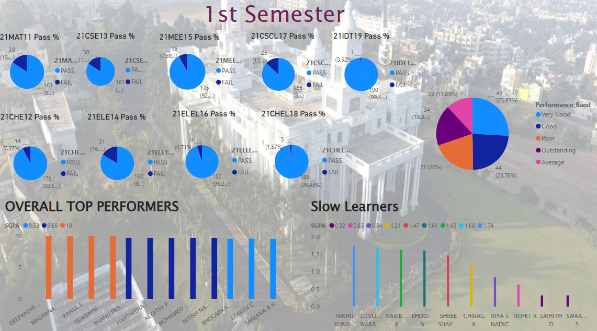
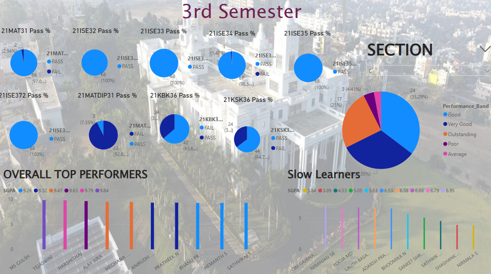
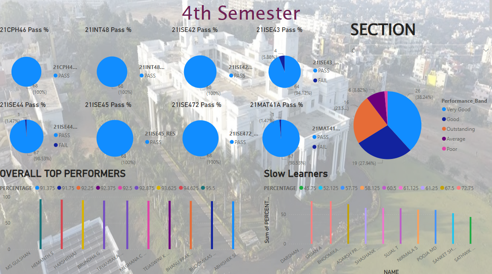

# Explorative Analysis Of Result Sheets

A data visualization project built using Microsoft Power BI, focusing on academic performance across three semesters. The dashboards highlight performance patterns, subject analysis, and semester-wise trends.

This upload showcases my contribution to a group project, focusing on visualizing the academic results of the 1st, 3rd, and 4th semesters using Power BI.

---

## Project Files

| File | Description |
| `RESULT_ANALYSIS.pbix` | Power BI project file with all visualizations |
| `1ST_SEM_OVERALL_RESULT_...xlsx` | Dataset for 1st semester |
| `3RD_SEM_RESULT_SHEET_...xlsx` | Dataset for 3rd semester |
| `4TH_SEM_RESULT_SHEET_...xlsx` | Dataset for 4th semester |

---

## Key Features

- Analyze subject-wise performance and pass percentages.
- Visualize top-performing students and overall score trends.
- Categorize students into performance bands.
- Compare subject trends across semesters.

---

## Tools Used

- **Power BI Desktop**
- **Excel** for preprocessing
  

---

## How to View the Dashboard

> Open the `RESULT_ANALYSIS.pbix` file using Power BI Desktop (free from Microsoft).

---

## Screenshots

### 1st Semester Dashboard

### 3rd Semester Dashboard

### 4th Semester Dashboard

